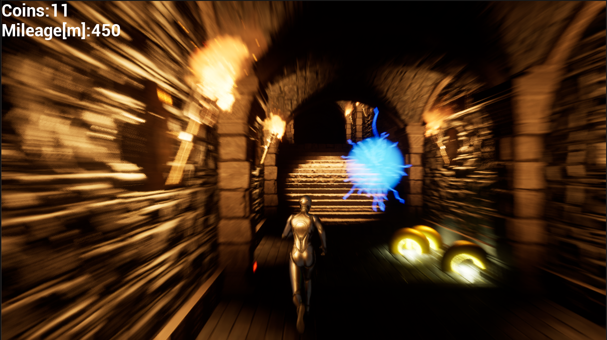

## ■ ゲームの概要



【ゲームタイトル】EndlessRun  
【ジャンル】アクション／ランゲーム  
【難易度】普通  
【プレイ時間】1分～  
【対象年齢】全年齢対象  
【開発環境】Unreal Engine 5.3.2  

> [!CAUTION]
> **このリポジトリは基本的にソースコードのみを公開しています。ゲームを起動するためのアセットファイルはほとんど含まれていません。動作確認はできませんが、ソースコードの確認としてご利用ください。**

### ソースコード：詳細情報
[Documentation](Documentation/) をチェックしてください。

## ■ ゲームの内容

### 【ゲームコンセプト】

#### 「走れ、避けろ、集めろ！限界の先へ挑むハイスピード・ランゲーム」

プレイヤーは障害物を避けながら無限に走り続け、コインの収集数と生存距離の両方でスコアを競うアクションランゲーム。操作はシンプルながら、ハイスコアを狙うには俊敏な反応が求められる。短時間でも遊べるテンポ感により、リトライ性の高いゲームを提供する。

### 【ゲームの具体例】

#### ▼ プレイシーン  
- プレイヤーは高速で自動的に前進し続けるキャラクターを操作し、左右への移動やジャンプを使って障害物を回避する。  
- 道中には感電する電気球や壁などの障害物が出現し、接触すると即ゲームオーバーになる。  
- コインを取りながら、安全なルートを選んで進もう。

#### ▼ スコアシステム  
- コインを1枚取るごとにスコアが加算される。  
- ゲーム終了時にコイン数と走行距離が記録され、スコアとして集計される。  
- コイン数が同じ場合、走行距離が長いプレイヤーがランキング上位になる。

#### ▼ エンドゲーム  
- プレイヤーがゲームオーバーになったタイミングでスコアが保存される。  
- スコアはランキングに反映され、トッププレイヤーと自分の成績を比較することができる。

## ■ 操作方法

### ▼ キーボード操作  
- **右移動**：→キー / Dキー  
- **左移動**：←キー / Aキー  
- **右に曲がる（交差点）**：→キー / Dキー  
- **左に曲がる（交差点）**：←キー / Aキー  
- **ジャンプ**：Spaceキー  
- **ポーズメニュー**：Qキー

> [!NOTE]
> 移動と曲がる操作が同じキーだが、状況（直進中 or 曲がり角）によって動作が変わる。

### ▼ マウス操作  
- **左クリック**：決定（メニュー操作など）

## ■ 動作環境

```
【OS】Windows 10 / Windows 11  
【CPU・GPU】Unreal Engine 5 推奨スペック以上  
```